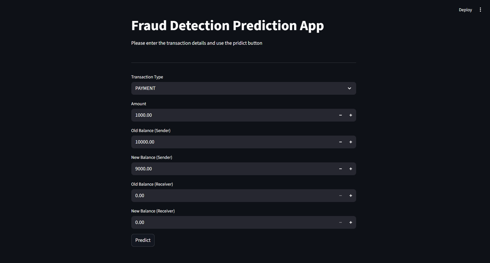
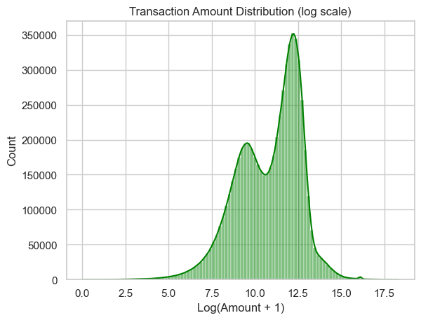

# Fraud Detection System

A machine learning-based fraud detection system that identifies fraudulent financial transactions using logistic regression. The project includes a complete pipeline from data analysis to deployment with an interactive Streamlit web application.


## 📋 Table of Contents

- [Overview](#overview)
- [Features](#features)
- [Screenshots](#screenshots)
- [Dataset](#dataset)
- [Data Exploration](#data-exploration)
- [Model Performance](#model-performance)
- [Installation](#installation)
- [Usage](#usage)
- [Project Structure](#project-structure)
- [Model Details](#model-details)
- [Web Application](#web-application)
- [Contributing](#contributing)
- [License](#license)

## 🎯 Overview

This project implements a fraud detection system for financial transactions. Using a logistic regression model with balanced class weights, the system analyzes transaction patterns to identify potentially fraudulent activities. The model is deployed through an intuitive Streamlit web interface for real-time predictions.

## ✨ Features

- **High Recall Rate**: 94% recall on fraudulent transactions, minimizing false negatives
- **Balanced Classification**: Uses class weighting to handle imbalanced datasets
- **Real-time Predictions**: Interactive web interface for instant fraud assessment
- **Comprehensive Pipeline**: Complete ML pipeline with preprocessing and standardization
- **Multiple Transaction Types**: Supports PAYMENT, TRANSFER, CASH_OUT, and DEPOSIT transactions

## 📸 Screenshots

### Web Application Interface

**Legitimate Transaction Detection:**


**Fraudulent Transaction Detection:**


The Streamlit application provides an intuitive interface where users can input transaction details and receive instant fraud predictions with clear visual feedback.

## 📊 Dataset

The model is trained on a financial transactions dataset containing 6.36 million records with the following features:

### Features Used
- **type**: Transaction type (PAYMENT, TRANSFER, CASH_OUT, DEPOSIT)
- **amount**: Transaction amount
- **oldbalanceOrg**: Initial balance of sender before transaction
- **newbalanceOrig**: New balance of sender after transaction
- **oldbalanceDest**: Initial balance of receiver before transaction
- **newbalanceDest**: New balance of receiver after transaction

### Target Variable
- **isFraud**: Binary indicator (0 = legitimate, 1 = fraudulent)

### Dataset Statistics
- Total transactions: 6,362,620
- Fraudulent transactions: 8,213 (0.13%)
- Legitimate transactions: 6,354,407 (99.87%)

## 🔍 Data Exploration

### Transaction Distribution

The dataset exhibits a significant class imbalance, with fraudulent transactions representing only 0.13% of all transactions. This imbalance is addressed through balanced class weights in the model.


### Transaction Types Analysis

Different transaction types show varying patterns. PAYMENT is the most common type, followed by TRANSFER and CASH_OUT operations.


### Fraud Patterns by Transaction Type

Analysis reveals that certain transaction types have higher fraud rates. This insight helps in understanding risk patterns across different transaction categories.


### Amount Distribution Comparison

Fraudulent transactions often show different amount distribution patterns compared to legitimate transactions, which helps the model identify suspicious behavior.



### Feature Correlations

Understanding feature correlations helps identify which variables are most important for fraud detection.


## 📈 Model Performance

The logistic regression model achieves the following performance metrics on the test set:


| Metric | Legitimate (0) | Fraudulent (1) | Overall |
|--------|---------------|----------------|---------|
| **Precision** | 1.00 | 0.02 | 0.95 |
| **Recall** | 0.95 | 0.94 | 0.95 |
| **F1-Score** | 0.97 | 0.04 | 0.95 |
| **Support** | 1,906,322 | 2,464 | 1,908,786 |

### Confusion Matrix
```
                Predicted
              Legit  Fraud
Actual Legit  1,805,561  100,761
      Fraud      150      2,314
```

**Overall Accuracy**: 94.71%

**Key Insight**: The model prioritizes catching fraudulent transactions (94% recall on fraud) at the cost of higher false positives, which is appropriate for fraud detection where missing fraud is more costly than investigating false alarms.

## 🚀 Installation

### Prerequisites
- Python 3.8 or higher
- pip package manager

### Setup

1. **Clone the repository**
```bash
git clone https://github.com/yourusername/fraud-detection-system.git
cd fraud-detection-system
```

2. **Create a virtual environment** (recommended)
```bash
python -m venv venv

# On Windows
venv\Scripts\activate

# On macOS/Linux
source venv/bin/activate
```

3. **Install required packages**
```bash
pip install -r requirements.txt
```

## 💻 Usage

### Training the Model

To train the model from scratch:

```bash
jupyter notebook analysis_model.ipynb
```

Run all cells in the notebook to:
- Load and explore the dataset
- Perform data preprocessing
- Train the logistic regression model
- Evaluate model performance
- Save the trained pipeline

### Running the Web Application

Launch the Streamlit web application:

```bash
streamlit run fraud_detection.py
```

The application will open in your browser at `http://localhost:8501`

### Making Predictions

1. Select the transaction type from the dropdown
2. Enter transaction details:
   - Amount
   - Old balance (Sender)
   - New balance (Sender)
   - Old balance (Receiver)
   - New balance (Receiver)
3. Click the "Predict" button
4. View the prediction result (Fraud or Not Fraud)

## 📁 Project Structure

```
fraud-detection-system/
│
├── analysis_model.ipynb          # Jupyter notebook for model development
├── fraud_detection.py            # Streamlit web application
├── fraud_detection_pipeline.pkl  # Trained model pipeline (serialized)
├── requirements.txt              # Python dependencies
├── README.md                     # Project documentation
├── images/            # Images App
└── data/                         # Dataset directory (not included)
    └── AIML_Dataset.csv          # Transaction dataset
```

## 🔧 Model Details

### Pipeline Components

1. **Column Transformer**
   - **Numerical Features**: Standardized using `StandardScaler`
     - amount, oldbalanceOrg, newbalanceOrig, oldbalanceDest, newbalanceDest
   - **Categorical Features**: One-hot encoded using `OneHotEncoder` (drop first)
     - type

2. **Classifier**
   - **Algorithm**: Logistic Regression
   - **Parameters**:
     - `class_weight='balanced'` - Adjusts weights inversely proportional to class frequencies
     - `max_iter=1000` - Maximum iterations for convergence

### Why Logistic Regression?

- Provides probability scores for fraud likelihood
- Interpretable coefficients for feature importance
- Fast training and prediction
- Effective with balanced class weights for imbalanced datasets
- Suitable for binary classification problems

## 🖥️ Web Application

The Streamlit application provides an intuitive interface for fraud detection:

### Features
- **User-friendly input forms** with validation
- **Real-time predictions** with color-coded results
- **Transaction type selection** via dropdown
- **Numerical inputs** with sensible defaults
- **Clear visual feedback** (green for safe, red for fraud)

### Interface Components
- Transaction Type selector
- Amount input field
- Balance fields for sender and receiver
- Predict button
- Results display with warning/success indicators

## 🤝 Contributing

Contributions are welcome! Please feel free to submit a Pull Request. For major changes:

1. Fork the repository
2. Create your feature branch (`git checkout -b feature/AmazingFeature`)
3. Commit your changes (`git commit -m 'Add some AmazingFeature'`)
4. Push to the branch (`git push origin feature/AmazingFeature`)
5. Open a Pull Request

### Areas for Improvement
- Experiment with other algorithms (Random Forest, XGBoost, Neural Networks)
- Feature engineering (transaction velocity, account age, etc.)
- Hyperparameter tuning
- Model ensembling
- Advanced visualization in the web app
- API endpoint for integration
- Docker containerization

## 📄 License

This project is licensed under the MIT License - see the LICENSE file for details.

## 🙏 Acknowledgments

- Dataset source: Financial transactions dataset
- Built with Streamlit, scikit-learn, and pandas
- Inspired by real-world fraud detection challenges in fintech

## 📧 Contact

For questions or feedback, please open an issue on GitHub.

---

**Note**: This is a demonstration project. For production use, additional security measures, model validation, and compliance considerations would be necessary.
